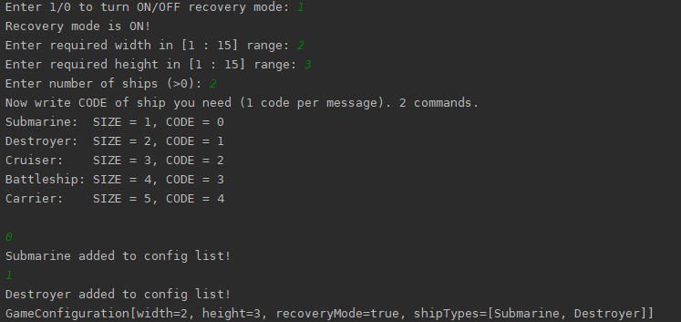
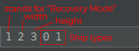
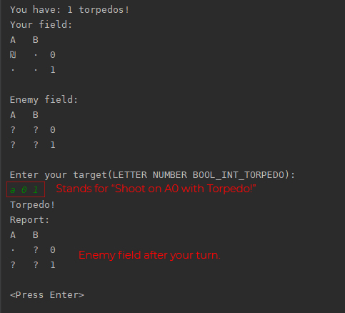

# **Морской Бой**. _Java 17 SDK_
### Выполнил [Горковец Роман Романович](vk.com/mordapikachu), БПИ204
Я захотел сделать полноценный морской бой с компьютером, поэтому прошу не закидывать
меня тапками за то, что это не полное следование ТЗ. Я действительно старался:)
***

## Структура проекта

Наименование | Количество
----- | -----
Interface | 3
Class | 17
Record | 1

***

## Дерево проекта

* **src/** _Здесь исходный код проекта_
    * game/ 
      * controls/ _тестовый файл, можете не смотреть_
      * main/ _Точка входа_
      * models/ _Здесь находятся классы кораблей и клеток поля_
      * utils/ _Вспомогательные функции_
* **out/** _Директория с модулями контейнеров_
    * artifacts/ _Здесь исполняемый файл_
        * SeaBattle_jar/
          * **SeaBattle.jar** _ИСПОЛНЯЕМЫЙ ФАЙЛ_
    * production/
      * ...
* **images/** _Здесь картинки для markdown_

***
## Запуск
### Стандартный способ:

 
 

### Через аргументы запуска:

> Можно писать корабли в разном порядке: 0 1 0 0 0 2

***

## Процесс игры

***